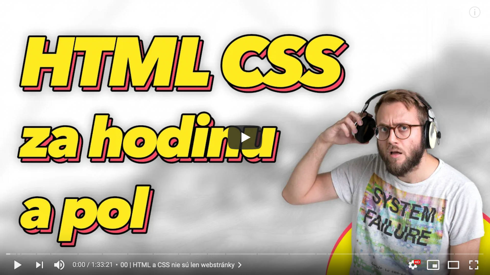

# HTML a CSS od základov 🇸🇰

**Naučím ťa HTML a CSS za hodinu a pol.** Web technológie (HTML, CSS, JS) nie sú len o webstránkach. Dnes nimi vieš vyrobiť plnohodnotné aplikácie. Mobilné, desktopové. HTML a CSS sú ideálny vstup do IT sveta. Do textu pridávaš tzv. značky, to je celé. Neexistujú tu žiadne algoritmy, funkcie, iné podlé slová. Každý to zvládne, stačí len čas a trpezlivosť a usmernenie. To ti dám! Tu!

Ak si učiteľ alebo škola, máš plné povolenie používať ako len chceš ❤️  
Ak ma chceš podporiť, môžeš cez **PATREON https://patreon.com/yablko** 🙏  
Patróni majú všetky videá skôr, kurzy dostanú aj ako text, občas im hodím ponuku na job a ďalšie srandy 👍  

---

### ✨ HTML a CSS 🇸🇰 od základov (1h 33m 21s)  
:: https://youtu.be/LULd0858mUQ  
  
  
  
--- 
  
### Odkazy
  
**CZ / SK ZDROJE (ak poznáš ďalšie, povedz mi)**  
:: https://www.jakpsatweb.cz  
:: https://zdrojak.cz  
:: https://www.czechitas.cz/cs/blog/tag/frontend  
:: https://www.learn2code.sk/blog/kategoria/vzdelavanie  

**NAJLEPŠIE HTML / CSS / JS ZDROJE**  
:: https://developer.mozilla.org/en-US/docs/Learn  
:: https://developer.mozilla.org/en-US/docs/Web/HTML  
:: https://developer.mozilla.org/en-US/docs/Web/CSS  
:: https://css-tricks.com  
  
**ZÁTVORKY A ŠPECIÁLNE ZNAKY NA KLÁVESNICI**  
:: https://www.alza.sk/ako-pisat-znaky-na-klavesnici  
:: https://tech.sme.sk/c/2817461/naucte-sa-na-klavesnici-pisat-zriedkave-znaky.html  
:: https://www.banger.sk/ako-pisat-specialne-znaky-na-klavesnici  

Niektorí píšu kód na SK klávesnici. Ja osobne neustále prepínam medzi Anglickou a Slovenskou klávesnicou.  
Na Windows myslím funguje kratka Alt + Shift na prepínanie jazykov, ak si ich pridáš viac.  

**CSS ŠPECIFICITA / KASKÁDA**  
:: https://www.vzhurudolu.cz/prirucka/css-kaskada  
:: https://developer.mozilla.org/en-US/docs/Web/CSS/Specificity  
:: https://css-tricks.com/specifics-on-css-specificity  
:: https://www.smashingmagazine.com/2007/07/css-specificity-things-you-should-know  

**7 ALTERNATIVES TO THE &lt;div&gt; HTML TAG**  
:: https://medium.com/@zac_heisey/7-alternatives-to-the-div-html-tag-7c888c7b5036  

**OSTATNÉ** 

ukážka, čo sa dá s CSS  
:: https://twitter.com/MengTo/status/1296834767560876032  
  
jednoduché pozadia čisto v CSS  
:: https://projects.verou.me/css3patterns  
:: https://bansal.io/pattern-css  

this vs. that (aký je rozdiel medzi X a Y)  
:: https://thisthat.dev  

nové CSS pseudo-classy  
:: https://www.smashingmagazine.com/2021/04/guide-supported-modern-css-pseudo-class-selectors  

firefox ti radí, prečo je CSS zápis ignorovaný  
:: https://twitter.com/JoshWComeau/status/1333900401586921474  

história webu  
:: https://home.cern/science/computing/birth-web/short-history-web  

kopíruj a kradni z kódu  
:: https://m.signalvnoise.compaying-tribute-to-the-web-with-view-source  

ehm  
:: https://open.spotify.com/artist/0CbbftseLRwYyUdmOXvH6l  

---

### Skús sama písať kód (to je jediný spôsob, ako sa to naučiť)

    napríklad vytvor gallery.html
    
    - bude mať rovnakú štruktúru ako moje index.html
    - pridaj na stránku obrázky (nájdi si vlastné, pekné, napríklad na unsplash.com)
    - obrázky obal do odkazov
    - kliknutie na obrázok zobrazí jeho väčšiu verziu
    - čiže na stránke sa bude zobrazovať zmenšená verzie
    - dosiahni, aby všetky zmenšené obrázky mali rovnakú veľkosť 

---

**KURZY, ktoré spomínam vo videu (trochu si spravím reklamu)**
  
HTML/CSS skús ZDARMA https://www.youtube.com/playlist?list=PL3VwAXKvhemVw5DnAqeGbZx5AgEQT27xF  
WEBREBEL kurz tu https://www.learn2code.sk/kurzy/webrebel-1-html-css-javascript  
Všetky moje learn2code kurzy https://www.learn2code.sk/instruktori/roman-hraska 1300+ videí  
Predplatné (dostaneš všetko, čo existuje) https://www.learn2code.sk/predplatne  
Tu nájdeš kopu ukážok z mojich kurzov, skús si ich ZDARMA https://www.youtube.com/c/Yablko/playlists?view=1&sort=dd&shelf_id=0

---

❤️ PATREON https://patreon.com/yablko  
🎬 YOUTUBE 2 https://youtube.com/yablko  
🍿 TWITCH https://twitch.com/yablko_  
📸 INSTAGRAM https://instagram.com/yablko  
👍 FACEBOOK https://www.facebook.com/yablko.smrdi  
🐦 TWITTER https://twitter.com/yablko  
📚 BLOGY https://medium.com/@yablko  
  
📚 Všetky moje learn2code kurzy  
:: https://www.learn2code.sk/instruktori/roman-hraska 1300+ videí
